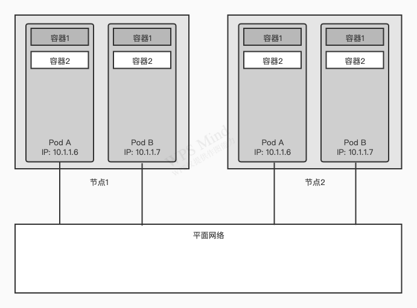

# 第三章 pod：运行于kubernates中的容器

## 3.1 介绍pod

当pod包含多个容器时，这些容器总是运行于同一个工作节点上，一个pod绝不会跨多个工作节点。

### 3.1.1 为何需要pod

容器被设计为每个容器只运行一个进程。

### 3.1.2 了解pod

由于不能将多个进程聚集在一个单独的容器中，我们需要另一种更高级的结构来将容器绑定在一起，并将它们作为一个单元进行管理，这就是pod背后的根本原理。在包含容器的pod下，我们可以同时运行一些密切相关的进程，并为它们提供相同的环境，此时这些进程就好像全部运行于单个容器中一样，同时又保持着一定的隔离。能利用容器所提供的特性，同时这些进程就像运行在一起一样。

#### 同一个pod中容器之间的部分隔离

上一章了解到容器是完全隔离的，但希望隔离容器组，而不是单个容器，让每个容器组内的容器共享一些资源，而不是全部，也就是没有完全隔离。k8s通过配置Docker来让一个pod内的所有容器共享相同的Linux命名空间，而不是每个容器都有自己的一组命名空间。（知识补充：UTS，UNIX Time-sharing System namespace提供了主机名和域名的隔离。能够使得子进程有独立的主机名和域名(hostname)，这一特性在Docker容器技术中被用到，使得docker容器在网络上被视作一个独立的节点，而不仅仅是宿主机上的一个进程。

  Docker中利用UTS namespace原理，每个镜像可以以本身所提供的服务名称来命名镜像的hostname，且不会对宿主机产生任何影响，由此达到主机名和域名的隔离效果。）。

由于一个pod中的所有容器都在相同的network和UTS命名空间下运行，so它们都共享相同的主机名和网络接口。这些容器也都在相同的IPC命名空间下运行，因此能通过IPC进行通信。在最新的k8s和Docker版本中，它们也能够共享相同的PID命名空间，但是该特征默认是未激活的。

`注意：当同一个pod中的容器使用单独的PID命名空间时，在容器中执行ps aux就只会看到容器自己的进程。`

但当设计文件系统时，情况不同。由于大多数容器文件系统来自容器镜像，默认情况下，每个容器文件系统与其他容器完全隔离。但可以使用名为Volume的Kubernates资源来共享文件目录，第六章讨论。

#### 容器如何共享相同的IP和端口空间

pod中的容器运行于同一个network命名空间中，so它们共享相同的IP地址和端口空间。同一pod中的容器运行的多个进程需要注意不能绑定到相同的端口号。这只涉及同一个pod中的容器。每个pod都有独立的端口空间，对于不同pod中的容器来说永远不会遇到端口冲突。一个pod中的所有容器也都具有相同的loopback网络接口，so容器可以通过localhost与同一pod中的其他容器进行通信。

（知识补充：Loopback接口是虚拟接口，是一种纯软件性质的虚拟接口。任何送到该接口的网络数据报文都会被认为是送往设备自身的。大多数平台都支持使用这种接口来模拟真正的接口。这样做的好处是虚拟接口不会像物理接口那样因为各种因素的影响而导致接口被关闭。事实上，将Loopback接口和其他物理接口相比较，可以发现Loopback接口有以下几条优点：
  1.Loopback接口状态永远是up的，即使没有配置地址。这是它的一个非常重要的特性。
  2.Loopback接口可以配置地址，而且可以配置全1的掩码,可以节省宝贵的地址空间。
  3.Loopback接口不能封装任何链路层协议。）

#### 介绍平坦pod间网络

Kubernates集群中的所有pod都在同一个共享网络地址空间中如下图。着意味着每个pod都可以通过其他pod的IP地址来实现相互访问，他们之间没有NAT（网络地址转换）网关。当两个pod彼此之间发送网络数据包时，他们都会将对方的实际IP地址看作数据包中的源IP。

