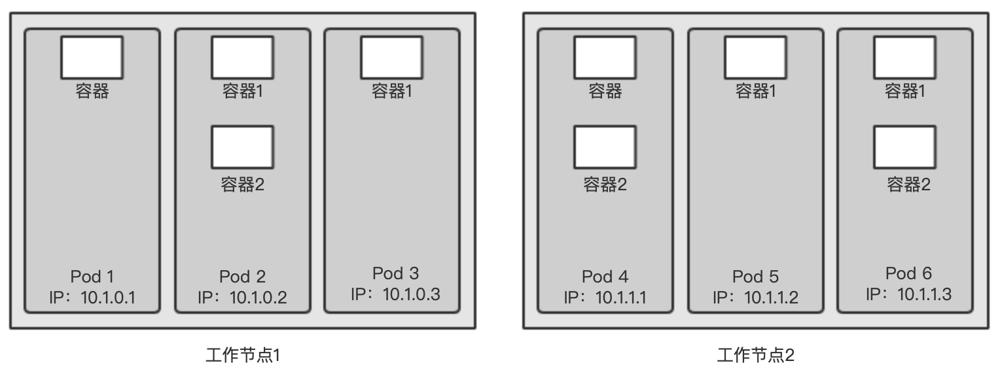
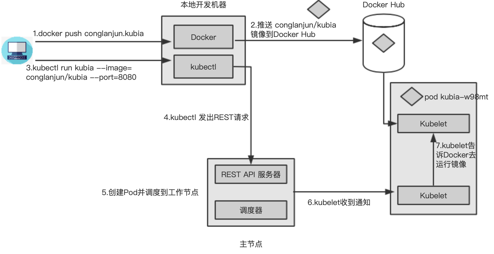
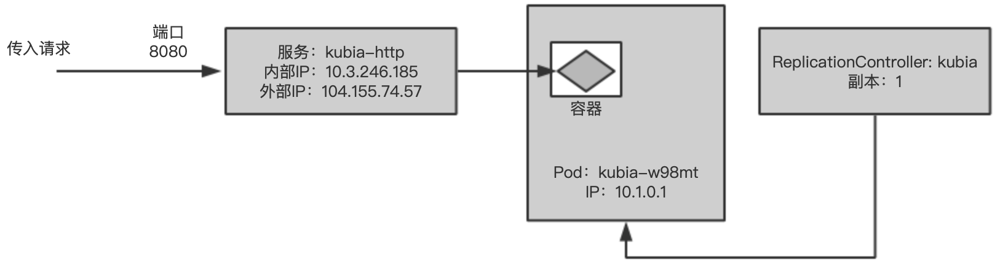
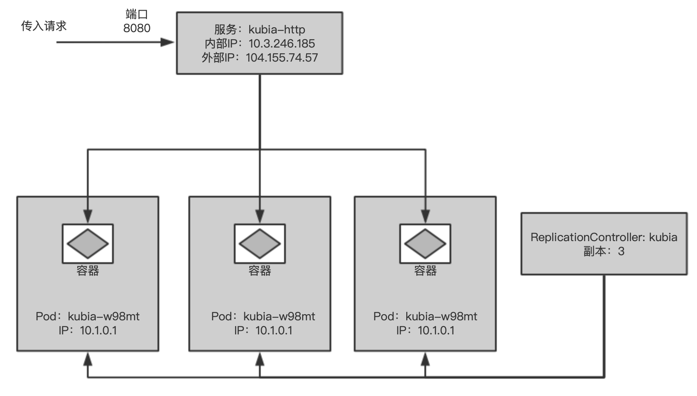

# 第二章 使用kubernates和docker

## 2.1 创建，运行及共享容器镜像

### 2.1.1 安装docker并运行hello world容器

访问`https://docs.docker.com/engine/install/` 进行安装。

```shell
sudo apt-get update
sudo apt-get install \
    apt-transport-https \
    ca-certificates \
    curl \
    gnupg-agent \
    software-properties-common
curl -fsSL https://download.docker.com/linux/ubuntu/gpg | sudo apt-key add -
sudo add-apt-repository \
   "deb [arch=amd64] https://download.docker.com/linux/ubuntu \
   $(lsb_release -cs) \
   stable"
sudo apt-get install docker-ce docker-ce-cli containerd.io
// 免sudo docker
sudo groupadd docker
sudo gpasswd -a ${USER} docker
sudo service docker restart
newgrp - docker
```

```shell
docker run busybox echo "Hello world"
----------------------------------------
Unable to find image 'busybox:latest' locally
latest: Pulling from library/busybox
ea97eb0eb3ec: Pull complete 
Digest: sha256:bde48e1751173b709090c2539fdf12d6ba64e88ec7a4301591227ce925f3c678
Status: Downloaded newer image for busybox:latest
Hello world
```

### 2.1.2 创建一个简单的Node.js应用

创建app.js文件

```javascript
const http = require('http');
const os = require('os');

console.log('Kubia server starting...');

var handler = function(request, response) {
  console.log("Received request from " + request.connection.remoteAddress);
  response.writeHead(200);
  response.end("You've hit " + os.hostname() + "\n");
};
var www = http.createServer(handler);
www.listen(8080);
```

### 2.1.3 为镜像创建Dockerfile

创建Dockerfile文件，包含构建镜像执行的命令。要和app.js在同一个目录。

```dockerfile
FROM node:7
ADD app.js /app.js
ENTRYPOINT ["node", "app.js"]
```

### 2.1.4 构建容器镜像

```shell
docker build -t kubia .
```

#### 镜像是如何构建的

构建过程不是docker客户端进行的，是将整个目录文件上传到docker守护进程并在那里进行的。docker客户端和守护进程不要求在同一台机器上。如果你在一台非linux操作系统中使用docker，客户端就运行在你的宿主操作系统上，但是守护进程运行在一个虚拟机内。构建目录中的文件都被上传到了守护进程中。

#### 镜像分层

镜像由很多层组成。每一层有一行pull complete，不同镜像会共享分层，会让存储和传输变得高效。dockerfile中每一条单独的指令到会创建一个新层。拉取基础镜像所有分层之后，docker在他们上面创建一个新层并且添加app.js。在创建另一层来指定镜像被运行时所执行的命令。最后一层被标记为`kubia:latest`。

```shell
docker images
--------------------
REPOSITORY   TAG       IMAGE ID       CREATED         SIZE
kubia        latest    07bd2bcd0ec6   7 minutes ago   660MB
busybox      latest    219ee5171f80   3 weeks ago     1.23MB
node         7         d9aed20b68a4   3 years ago     660MB
```

### 2.1.5 运行容器镜像

运行镜像

```shell
docker run --name kubia-container -p 8080:8080 -d kubia
curl localhost:8080
---------------------
You've hit 23e534095d05
```

23e534095d05作为主机名返回。不是宿主机的主机名，是docker容器ID。

```shell
docker ps
---------------------
CONTAINER ID   IMAGE     COMMAND         CREATED              STATUS              PORTS                    NAMES
23e534095d05   kubia     "node app.js"   About a minute ago   Up About a minute   0.0.0.0:8080->8080/tcp   kubia-container
---------------------
docker inspect kubia-container // 查看容器的详细json信息
```

### 2.1.6 探索运行容器的内部

```shell
docker exec -it kubia-container bash
```

-i 确保输入流开放。-t 分配终端。

```shell
ps aux
---------------------
USER        PID %CPU %MEM    VSZ   RSS TTY      STAT START   TIME COMMAND
root          1  0.0  0.3 614432 26468 ?        Ssl  07:09   0:00 node app.js
root         13  0.0  0.0  20244  3064 pts/0    Ss   07:14   0:00 bash
root         19  0.0  0.0  17500  2040 pts/0    R+   07:15   0:00 ps aux
```

容器内看到三个进程。

查看宿主机操作系统上的进程。

```shell
ps aux | grep app.js
---------------------
root      15049  0.0  0.3 614432 26468 ?        Ssl  07:09   0:00 node app.js
azureus+  15478  0.0  0.0  11468  1100 pts/0    S+   07:16   0:00 grep --color=auto app.js
```

证明了运行在容器中的进程是运行在宿主机操作系统上的。且进程ID不同。容器使用独立的PID Linux命名空间并且有着独立的系列号，完全独立于进程树。也有独立的文件系统。

### 2.1.7 停止和删除容器

```shell
docker stop kubia-container
// 可以通过docker ps -a查看。-a查看所有的容器，包括运行中的和已经停止的。要删除容器运行docker rm
docker rm kubia-container
```

### 2.1.8 向镜像仓库推送镜像

可以把本地镜像推送到外部的镜像仓库，公开的仓库有Docker Hub（http://hub.docker.com）。还有其他的Quay.io和Google Container Registry。Docker Hub允许向以你的Docker Hub ID开头的镜像仓库推送镜像。可以在Docker Hub（http://hub.docker.com）注册Docker Hub ID。本人的ID是conglanjun。

```shell
docker tag kubia conglanjun/kubia
docker images // 给出了额外的标签。
---------------------
REPOSITORY         TAG       IMAGE ID       CREATED       SIZE
conglanjun/kubia   latest    07bd2bcd0ec6   4 hours ago   660MB
kubia              latest    07bd2bcd0ec6   4 hours ago   660MB
busybox            latest    219ee5171f80   3 weeks ago   1.23MB
node               7         d9aed20b68a4   3 years ago   660MB
```

conglanjun/kubia和kubia指向同一个镜像ID。实际上是同一个镜像两个标签。

#### 向Docker Hub推送镜像

```shell
docker login
----------------------
Login with your Docker ID to push and pull images from Docker Hub. If you don't have a Docker ID, head over to https://hub.docker.com to create one.
Username: conglanjun
Password: 
WARNING! Your password will be stored unencrypted in /home/azureuser/.docker/config.json.
Configure a credential helper to remove this warning. See
https://docs.docker.com/engine/reference/commandline/login/#credentials-store
---------------------
docker push conglanjun/kubia
```

可以在任何机器上运行镜像：

```shell
docker run -p 8080:8080 -d conglanjun/kubia
```

## 2.2 配置Kubernates集群

应用被打包在一个容器镜像中，通过Docker Hub给大家使用，可以将它部署到Kubernates集群中，先设置集群。

不精通Linux网络管理的话设置完整，多节点集群很困难。安装集群方法在http://kubernates.io文档有详细描述。本章介绍两种简单的方法构建集群，在本级上运行单节点集群，以及如何访问运行在Google Kubernates Engine（GKE）上的托管集群。

第三个选项是使用kubeadm工具安装一个集群，会在附录B介绍。展示了建立三节点集群，但是建议阅读本书前11章之后再尝试。

另一个选择时再亚马逊的AWS（Amazon Web Services）上安装kubernates。可以查看kops工具，是kubeadm基础之上构建的。

### 2.2.1 用Minikube运行一个本地单节点Kubernates集群

使用Minikube是运行Kubernates集群最简单的途径。

#### 安装Minikube

是二进制文件，访问（https://minikube.sigs.k8s.io/docs/start/）。

```shell
curl -LO https://storage.googleapis.com/minikube/releases/latest/minikube-linux-amd64
sudo install minikube-linux-amd64 /usr/local/bin/minikube
minikube start
-----------------------
😄  minikube v1.16.0 on Ubuntu 18.04
✨  Automatically selected the docker driver
👍  Starting control plane node minikube in cluster minikube
🚜  Pulling base image ...
💾  Downloading Kubernetes v1.20.0 preload ...
    > preloaded-images-k8s-v8-v1....: 491.00 MiB / 491.00 MiB  100.00% 32.82 Mi


❗  minikube was unable to download gcr.io/k8s-minikube/kicbase:v0.0.15-snapshot4, but successfully downloaded kicbase/stable:v0.0.15-snapshot4 as a fallback image
🔥  Creating docker container (CPUs=2, Memory=2200MB) ...
❗  This container is having trouble accessing https://k8s.gcr.io
💡  To pull new external images, you may need to configure a proxy: https://minikube.sigs.k8s.io/docs/reference/networking/proxy/
🐳  Preparing Kubernetes v1.20.0 on Docker 20.10.0 ...
    ▪ Generating certificates and keys ...
    ▪ Booting up control plane ...
    ▪ Configuring RBAC rules ...
🔎  Verifying Kubernetes components...
🌟  Enabled addons: storage-provisioner, default-storageclass
💡  kubectl not found. If you need it, try: 'minikube kubectl -- get pods -A'
```

#### 安装Kubernates客户端（kubectl）

```shell
chmod +x ./kubectl
sudo mv ./kubectl /usr/local/bin/kubectl
kubectl version --client
-----------------------
Client Version: version.Info{Major:"1", Minor:"20", GitVersion:"v1.20.1", GitCommit:"c4d752765b3bbac2237bf87cf0b1c2e307844666", GitTreeState:"clean", BuildDate:"2020-12-18T12:09:25Z", GoVersion:"go1.15.5", Compiler:"gc", Platform:"linux/amd64"}
```

#### 使用kubectl查看集群是否正常工作

```shell
kubectl cluster-info
-----------------------
Kubernetes control plane is running at https://192.168.49.2:8443
KubeDNS is running at https://192.168.49.2:8443/api/v1/namespaces/kube-system/services/kube-dns:dns/proxy
```

### 2.2.2 使用Google Kubernates Engine托管Kubernates

由于步骤繁琐，暂时不用GKN。

```shell
// 列出集群节点
kubctl get nodes // 由于刚才使用了minikube，因此列出了minikube的node
-----------------------
NAME       STATUS   ROLES                  AGE   VERSION
minikube   Ready    control-plane,master   14m   v1.20.0
```

kubectl get可列出各种kubernates对象。只会显示对象最基本的信息。

#### 查看更多的信息

```shell
kubectl describe node minikube
```

输出显示了节点的状态，cpu和内存数据，系统信息，运行容器的节点等。可以使用kubectl describe node无须指定节点名，将打印所有节点的描述信息。

#### 2.2.3 位kubectl配置别名和命令行补齐

这里不过多说明。

## 2.3 在kubernates上运行第一个应用

要准备json或yaml，包含需要部署的所有组件描述的配置文件。

### 2.3.1 部署Node.js应用

部署应用最简单方式是使用kubectl run，可以创建所有必要的组件无需json或yaml文件。就不需要深入了解每个组件对象的结构。

```shell
kubectl run kubia --image=conglanjun/kubia --port=8080 --generator=run/v1
```

--image指定容器镜像，--port告诉kubernates应用正在监听端口。但是--generator=run/v1禁用。只能通过yaml文件启动ReplicationController。

创建Nubia-rc.yml

```yml
apiVersion: v1
kind: ReplicationController
metadata:
  name: kubia
spec:
  replicas: 1
  selector:
    app: kubia
  template:
    metadata:
      labels:
        app: kubia
    spec:
      containers:
      - name: kubia
        image: conglanjun/kubia
        ports:
        - containerPort: 8080
```

```shell
kubectl create -f kubia-rc.yml
----------------------
replicationcontroller/kubia created
----------------------
kubectl get rc
----------------------
NAME    DESIRED   CURRENT   READY   AGE
kubia   1         1         0       28s
```

#### 介绍pod

kubernates不直接处理单个容器。相反，它使用多个共存容器的概念。这组容器叫pod。

一个pod是一组紧密相关的容器，他们总是一起运行在同一个工作节点上，以及同一个Linux命名空间中。每个pod就像一个独立的逻辑机器，拥有自己的IP，主机名，进程等，运行一个独立的应用程序。应用程序可以是单个进程，运行在单个容器中。一个pod所有容器都运行在同一个逻辑机器上，而其他pod中的容器，即使运行在同一个工作节点上，也会出现在不同的节点上。

每个pod都有自己的IP，并包含一个或多个容器，每个容器都运行一个应用程序。pod分布在不同的工作节点上。



#### 列出pod

不能列出单个容器，它们不是kubernates对象，但可以列出pod。

```shell
kubectl get pods
---------------------------
NAME          READY   STATUS    RESTARTS   AGE
kubia-w98mt   0/1     Pending   0          56s
```

pod状态列出READY 0/1，表示pod单个容器还未就绪。因为pod被分配到的工作节点正在下载容器镜像，完成之后才可以运行。



### 2.3.2 访问web应用

每个pod都有自己的ip地址，但这个地址是集群内部的，不能从集群外部访问。要让pod能从外部访问，需要通过服务对象公开它，要创建一个特殊的LoadBalancer类型的服务。如果创建常规服务（一个ClusterIP服务），比如pod，它只能从集群内部访问。通过创建LoadBalancer类型的服务，将创建一个外部的负载均衡，可以通过负载均衡的公共IP访问pod。

#### 创建一个服务对象

要创建服务，需要告知kubernates对外暴露之前创建的ReplicationController：

```shell
kubectl expose rc kubia --type=LoadBalancer --name kubia-http
--------------------
service/kubia-http exposed
```

rc是replicationcontroller缩写。pods缩写是po，service缩写是svc等等。

#### 列出服务

expose命令的输出提到了kubia-http的服务。服务类似于pod和node的对象，可以通过运行kubectl get services查看新创建的服务对象。

```shell
kubectl get services //kubectl get svc得到同样的结果
--------------------
NAME         TYPE           CLUSTER-IP    EXTERNAL-IP   PORT(S)          AGE
kubernetes   ClusterIP      10.96.0.1     <none>        443/TCP          12m
kubia-http   LoadBalancer   10.105.19.6   <pending>     8080:32409/TCP   4m15s
```

kubia-http服务还没有外部IP地址，kubernates基础设施创建负载均衡需要一段时间。负载均衡启动后，会显示外部IP地址。

minikube不支持LoadBalancer类型的服务，因此服务不会有外部IP，但是可以通过外部端口访问服务。

```shell
// 获取可以访问服务的IP和端口
minikube service kubia-http
---------------------
|-----------|------------|-------------|---------------------------|
| NAMESPACE |    NAME    | TARGET PORT |            URL            |
|-----------|------------|-------------|---------------------------|
| default   | kubia-http |        8080 | http://192.168.49.2:32409 |
|-----------|------------|-------------|---------------------------|
🎉  Opening service default/kubia-http in default browser...
👉  http://192.168.49.2:32409
```

```shell
curl http://192.168.49.2:31433
You've hit kubia-w98mt
```

应用程序将pod名称作为主机名。每个pod就像一个独立的机器，具有自己的IP地址和主机名。尽管应用程序运行在工作节点的操作系统中，但对应用程序来说，它似乎是在一个独立的机器上运行，而这台机器本身就是应用程序的专用机器，没有其他的进程一同运行。

#### 2.3.3 系统的逻辑部分

我们并不知道主节点上否管理这kubernates控制层的所有组件，或者它们是否跨多个节点。这并不重要，你只与单点访问的API服务进行交互。

#### Replication Controller，pod和服务是如何组合在一起的

kubernates的基本组件是pod。运行kubectl run创建了一个Replication Controller，它用于创建pod实例。为了使该pod能够从集群外部访问，需要让kubernates将该Replication Controller管理的所有pod由一个服务队外暴露。



#### pod和它的容器

pod可以包含任意数量的容器。容器内部是Node.js进程，该进程绑定到8080端口，等待http请求。pod有自己独立的私有IP地址和主机名。

#### ReplicationController的角色

它确保存在一个运行中的pod实例。通常rc用于复制pod（即创建pod的多个副本）并让它们保持运行。如果pod因为任何原因小时了，那么rc将创建一个新的pod替代消失的pod。

#### 为什么需要服务

需要kubia-http服务。pod的存在是短暂的，一个pod可能会在任何时候消失。消失的pod将被rc替换为新的pod。新pod与旧pod有不同的IP地址。这就需要服务解决不断变化的IP地址问题，以及在一个固定的IP和端口上队外暴露更多个pod。当服务被创建时会得到一个静态IP，在服务生命周期中这个IP不会发生改变。客户端通过固定IP连接到服务，而不是直接连接pod。服务会确保其中一个pod接收连接，而不关心pod当前运行在哪里（以及它的IP地址是什么）。服务表示一组或多组提供相同服务的pod的静态地址。到达服务IP和端口的请求将被转发到属于该服务的一个容器的IP和端口。

### 2.3.4 水平伸缩应用

```shell
kubectl get replicationcontrollers
----------------------
NAME    DESIRED   CURRENT   READY   AGE
kubia   1         1         1       61m
```

列出了名为kubia的单个ReplicationController。DESIRED列显示了希望ReplicationController保持的pod服本数，而CURRENT列显示当前运行的pod数。

#### 增加期望的副本数

```shell
kubectl scale rc kubia --replicas=3
-----------------------
replicationcontroller/kubia scaled
```

声明性地改变系统期望状态，让kubernates检查当前的状态是否与期望状态一致。

#### 查看扩容的结果

```shell
kubectl get rc
-----------------------
NAME    DESIRED   CURRENT   READY   AGE
kubia   3         3         3       65m
```

```shell
kubectl get pods
-----------------------
NAME          READY   STATUS    RESTARTS   AGE
kubia-gncz9   1/1     Running   0          5m31s
kubia-nvkdp   1/1     Running   0          5m31s
kubia-w98mt   1/1     Running   0          69m
```

#### 当切换到服务时请求切换到所有三个pod上

应用的多个实例在运行，再次请求结果：

```shell
azureuser@vm-big-data-1:~/kubernates$ curl http://192.168.49.2:31433
You've hit kubia-gncz9
azureuser@vm-big-data-1:~/kubernates$ curl http://192.168.49.2:31433
You've hit kubia-w98mt
azureuser@vm-big-data-1:~/kubernates$ curl http://192.168.49.2:31433
You've hit kubia-nvkdp
```

请求随机切换到不同的pod。服务作为负载均衡挡在多个pod前面。

#### 可视化系统的新状态

三个pod实例由ReplicationController管理，请求分散到所有三个pod中。



### 2.3.5 查看应用运行在哪个节点上

#### 列出pod时显示pod IP和pod的节点

```shell
ubectl get pods -o wide
-----------------------
NAME          READY   STATUS    RESTARTS   AGE   IP           NODE       NOMINATED NODE   READINESS GATES
kubia-gncz9   1/1     Running   0          21m   172.17.0.3   minikube   <none>           <none>
kubia-nvkdp   1/1     Running   0          21m   172.17.0.4   minikube   <none>           <none>
kubia-w98mt   1/1     Running   0          84m   172.17.0.2   minikube   <none>           <none>
```

#### 使用kubectl describe查看pod的其他细节

```shell
kubectl describe pod kubia-nvkdp
```

